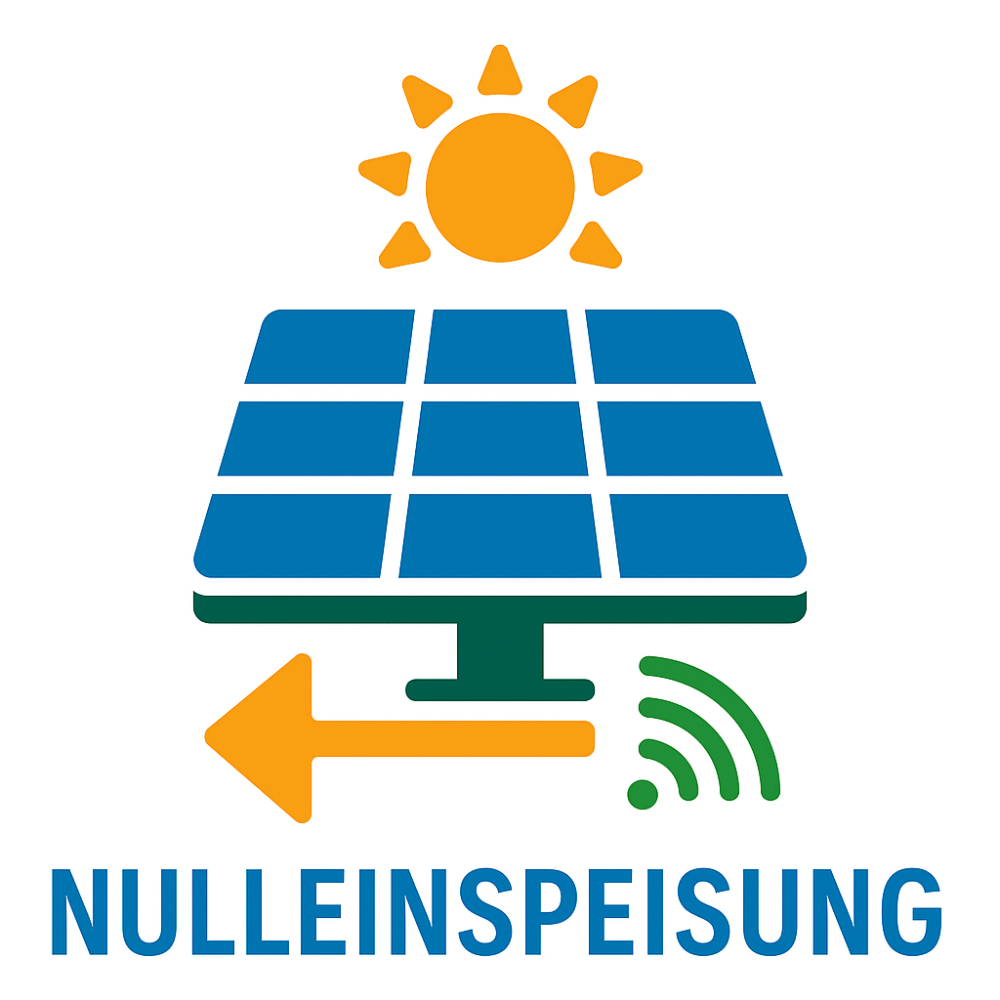

# ioBroker.nulleinspeisung

**Tests:** 

## 🔧 Beschreibung

Der Adapter **"Nulleinspeisung"** überwacht deine aktuelle Einspeiseleistung (PV-Überschuss) und schaltet definierte Verbraucher dynamisch zu oder ab. Ziel ist es, die Einspeisung ins Netz auf Null zu reduzieren, indem überschüssige Energie lokal verbraucht wird.

---

## 🚀 Funktionen

- ✅ Überwachung eines konfigurierbaren Einspeisungs-Datenpunkts
- ✅ Dynamische Zuschaltung von Verbrauchern bei Überschuss
- ✅ Dynamische Abschaltung bei Defizit oder Netzbezug
- ✅ Unterstützt **binary** (Ein/Aus) und **percent** (Prozentregelbare) Verbraucher
- ✅ Prozentregelung (z.B. Wallboxen) mit linearer Anpassung basierend auf Überschuss
- ✅ Reihenfolgenverwaltung (Last-In-First-Out Abschaltung)
- ✅ Konfigurierbare Grundlast, Ein- und Abschaltgrenzen sowie Schaltverzögerungen
- ✅ Hysterese-Vermeidung durch separate Ein- und Ausschaltgrenzen

---

## ⚙️ Konfiguration

### 🔹 Haupteinstellungen

| Einstellung                 | Beschreibung                                                                          |
| --------------------------- | ------------------------------------------------------------------------------------- |
| **Einspeisungs-Datenpunkt** | Objekt-ID des Datenpunkts, der deine Einspeisung in Watt liefert (z.B. PV-Überschuss) |
| **Grundlast**               | Dauerhafter Eigenverbrauch, der immer abgezogen wird (z.B. Router, Standby-Geräte)    |
| **Einschaltgrenze**         | Überschuss in Watt, ab dem Verbraucher zugeschaltet werden                            |
| **Abschaltgrenze**          | Unterschuss in Watt, ab dem Verbraucher abgeschaltet werden                           |
| **Verzögerung (Sekunden)**  | Zeitverzögerung bei der Abschaltung, um kurzfristige Schwankungen abzufangen          |

---

### 🔹 Verbraucher

| Feld                     | Beschreibung                                                                                     |
| ------------------------ | ------------------------------------------------------------------------------------------------ |
| **Aktiv**                | Aktiviert oder deaktiviert den Verbraucher in der Steuerung                                      |
| **Name**                 | Freie Bezeichnung für den Verbraucher                                                            |
| **Steuer-Datenpunkt**    | Objekt-ID, die Ein/Aus oder Prozentwert des Verbrauchers steuert                                 |
| **Gesamtleistung**       | Leistung in Watt, die bei Zuschaltung abgerufen wird                                             |
| **Einschaltung**         | Mindestüberschuss in Watt, der für die Zuschaltung erforderlich ist                              |
| **Abschaltung**          | Unterschreitungswert in Watt, bei dem der Verbraucher abgeschaltet wird                          |
| **Regeltyp**             | „Ein/Aus“ für binary Verbraucher oder „Prozentregelung“ für stufenlos regelbare Verbraucher      |
| **DelaySeconds_Prozent** | Verzögerung in Sekunden bei Rückregelung von Prozentwerten (z.B. Wallbox langsam herunterregeln) |

---

## 📊 Funktionsweise

1. **Einspeisung > Grundlast + Einschaltgrenze**  
   ➔ Verbraucher werden gemäß aufsteigender Leistungsgröße zugeschaltet, soweit der Überschuss ausreicht.

2. **Einspeisung < Grundlast - Abschaltgrenze**  
   ➔ Nach konfigurierter Verzögerung werden Verbraucher in umgekehrter Zuschalt-Reihenfolge abgeschaltet, bis das Defizit ausgeglichen ist.

3. **Prozentregelung (z.B. Wallbox)**
   ➔ Geräte mit „Regeltyp: Prozentregelung“ erhalten eine lineare prozentuale Steuerung basierend auf dem aktuellen Überschuss im Verhältnis zur konfigurierten Gesamtleistung.
   ➔ Bei Überschuss > Gesamtleistung wird auf 100 % geregelt, bei niedrigem Überschuss entsprechend heruntergeregelt bis ggf. auf 0 %.
   ➔ Das Rückregeln kann mit **DelaySeconds_Prozent** verzögert werden, um sanfte Übergänge zu gewährleisten.

4. **Innerhalb Hysterese**  
   ➔ Keine Änderung; laufende Abschalt-Timer werden abgebrochen.

---

## 💡 Beispiel

| Parameter       | Wert   |
| --------------- | ------ |
| Grundlast       | 100 W  |
| Einschaltgrenze | 50 W   |
| Abschaltgrenze  | 50 W   |
| Einspeisung     | 500 W  |
| Wallbox max     | 3500 W |

**Berechnung (Wallbox, Prozentregelung):**

- Überschuss = 500 - 100 = 400 W
- 400 W / 3500 W = ca. 11 % Ladeleistung
  \_ Wallbox wird auf 11 % gesetzt (abhängig von unterstütztem minimalem Ladestrom der Wallbox).

---

## 🔍 Bekannte Einschränkungen

- Keine Priorisierung außerhalb der Leistungsgröße implementiert
- Keine automatische Unterstützung für kombinierte Geräte (z.B. WP mit stufenlosem Modus + Heizstab)
- Kein persistentes State-Tracking bei Adapter-Neustart
- Minimal-/Maximalgrenzen der Prozentregelung müssen ggf. auf Geräteeigenschaften angepasst werden

---

## 🛠️ Zukünftige Features (Roadmap)

- Blackout-Schutzschwelle (alle Verbraucher sofort aus)
- Zeitabhängige Zuschaltlogik (z.B. nach PV-Erwartung)
- Mindestprozentwerte für Wallboxen (z.B. 6A/10A Minimum)

---

## Changelog

<!--
	Placeholder for the next version (at the beginning of the line):
	### **WORK IN PROGRESS**
-->
### 0.0.2 (2025-07-10)

- (quorle) initial release
- (quorle) Added true/false switching logic for consumers. Readme adjusted.
- (quorle) Added percentage control for controllable consumers such as wallboxes including DelaySeconds_Percent.

## License

MIT License

Copyright (c) 2025 quorle <quorle12@gmail.com>

Permission is hereby granted, free of charge, to any person obtaining a copy
of this software and associated documentation files (the "Software"), to deal
in the Software without restriction, including without limitation the rights
to use, copy, modify, merge, publish, distribute, sublicense, and/or sell
copies of the Software, and to permit persons to whom the Software is
furnished to do so, subject to the following conditions:

The above copyright notice and this permission notice shall be included in all
copies or substantial portions of the Software.

THE SOFTWARE IS PROVIDED "AS IS", WITHOUT WARRANTY OF ANY KIND, EXPRESS OR
IMPLIED, INCLUDING BUT NOT LIMITED TO THE WARRANTIES OF MERCHANTABILITY,
FITNESS FOR A PARTICULAR PURPOSE AND NONINFRINGEMENT. IN NO EVENT SHALL THE
AUTHORS OR COPYRIGHT HOLDERS BE LIABLE FOR ANY CLAIM, DAMAGES OR OTHER
LIABILITY, WHETHER IN AN ACTION OF CONTRACT, TORT OR OTHERWISE, ARISING FROM,
OUT OF OR IN CONNECTION WITH THE SOFTWARE OR THE USE OR OTHER DEALINGS IN THE
SOFTWARE.
